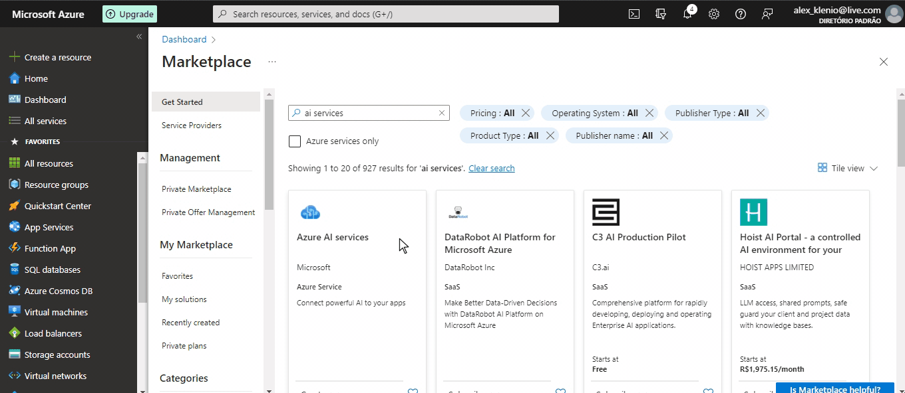
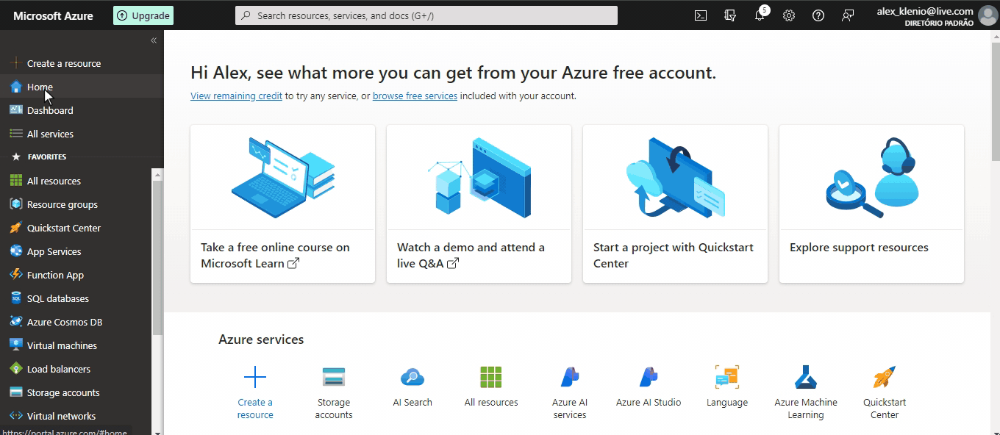
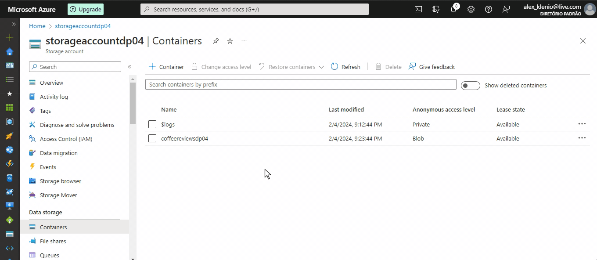
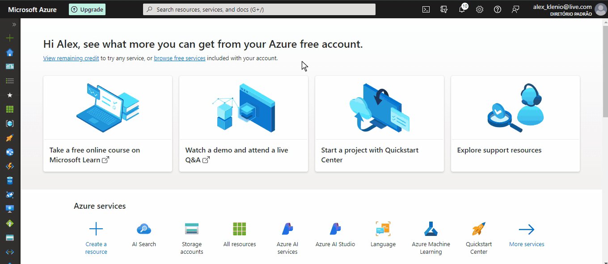
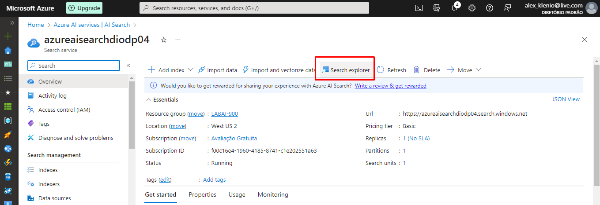
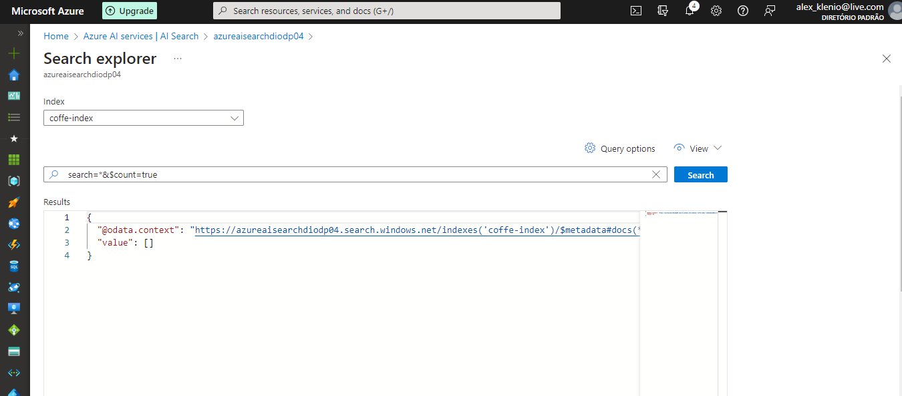
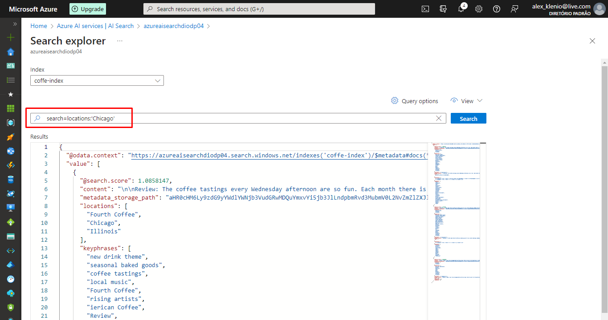

Este passo a passo servirá de guia para testar o serviço Azure AI Search. A proposta deste tutorial é criar uma pesquisa que funcione juntamente com um serviço de inteligência artificial para identificar palavras chave, sentimentos, utilizando também o serviço de armazenamento do azure.

## Passo 1: Criando recurso do Asure AI Search:

## Passo 2: Criando recurso do Azure AI services:

## Passo 3: Criando o storage:

## Passo 4: Permitindo acesso anônimo ao Blob:

Apenas para fins didáticos, com intuito de aprender os princípios da inteligência artificial com o Azure, vamos permitir o acesso anônimo ao blob para simplificar e facilitar nossas implementações. Após criar o seu Storage, entre no mesmo e navegue até a guia **Settings>Configuration** seguindo os passos abaixo:

## Passo 5: Criando o Container:

Navegue até a guia Data **Storage>Containers**, para criar o contanier dentro do storage e adicionar as pesquisas que seram analisadas pelo AI Service.

## Passo 6: Importação e indexação dados para o AI SEARCH:

Neste ponto você precisa importar os dados que você inseriu e configurou no seu storage, volte para o AI Search e siga os passos abaixo:

Esta é a parte mais importante de todo o processo, assim como o [tutorial oficial Microsoft](https://microsoftlearning.github.io/mslearn-ai-fundamentals/Instructions/Labs/11-ai-search.html#upload-documents-to-azure-storage) alerta, são muitos passos que que você precisa seguir a risca. Porém existe uma diferença da documentação oficial para o que aparece durante o processo.

Ao seguir a Documentação você chegará em Index Documents, o qual a animação acima mostra o início do processo, siga os tópicos até chegar na sessão "4. In the Attach Cognitive Services section, select your Azure AI services resource".

Note que a instrução manda que selecionemos o recurso AI Service configurado, porém para não aparece nenhum, apenas uma informação dizendo que o acesso é gratuito e que as configurações são limitadas, não se preocupe e pode passar para o passo "5. In the Add enrichments section".

Siga todas as configurações terminando no passo "17. Select the indexer name to see more details".

## Passo 7: Cnsultando o índice:

Feitas todas as configurações vamos voltar ao Azure AI Services, entrar no nosso serviço e através do Search Explorer testar se tudo foi indexado e se a consulta está funcionando, utilizando os comandos:

search=*&$count=true    (  verifica se a indexação esta funcionando e mostra os documentos )

search=locations:'Chicago' ( Consulta as ocorrencias acontecidas em Chicado )

search=sentiment:'negative' ( Consulta as ocorrencias com sentimento negativo )

## Referência:

[Explore an Azure AI Search index (UI)](https://microsoftlearning.github.io/mslearn-ai-fundamentals/Instructions/Labs/11-ai-search.html#upload-documents-to-azure-storage)

[Azure AI Search documentation](https://learn.microsoft.com/en-us/azure/search/)
